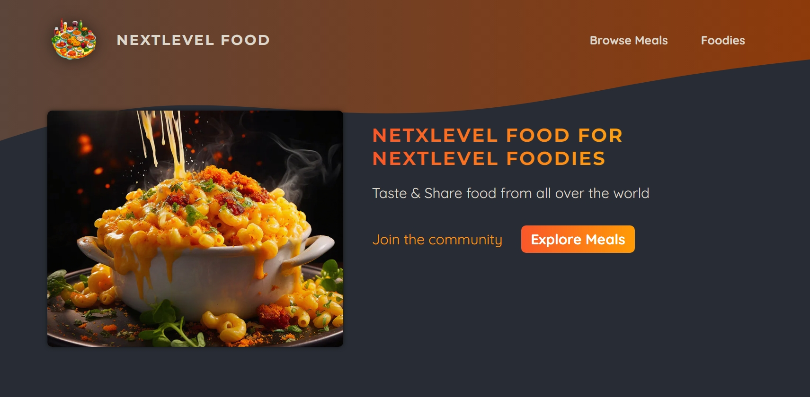
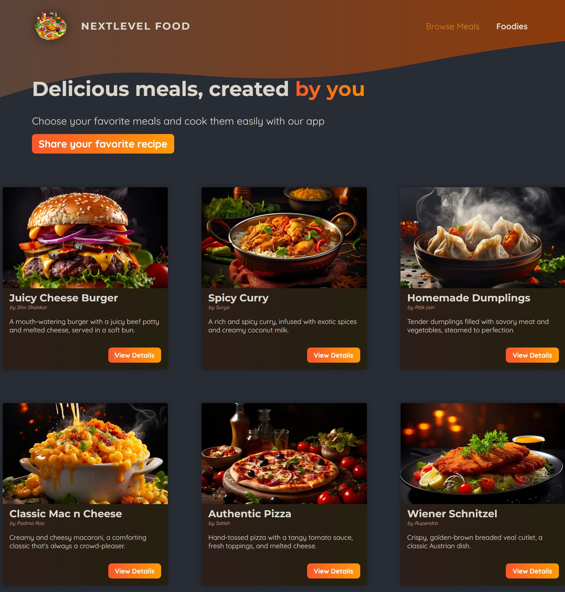

# NextLevelFood

NextLevelFood is a project aimed at creating a dynamic and interactive platform for exploring various meals and their nutritional information. Built using modern web technologies, this project is a demonstration of integrating frontend and backend development seamlessly.

## Project Structure

- **app**: Contains the main application logic.
- **assets**: Contains static assets like images and styles.
- **components**: Reusable UI components.
- **lib**: Library files and utilities.
- **public**: Publicly accessible files, including images.
- **initdb.js**: Script to initialize the database.
- **meals.db**: Database file containing meal information.

## Features

- Browse various meals with detailed nutritional information.
- Interactive UI with responsive design.
- Dynamic content loading from a SQLite database.
- Hosted on Vercel for seamless deployment.

## How to Run Locally

1. **Clone the repository**:
    ```bash
    git clone https://github.com/marix-shiv/NextLevelFood.git
    ```

2. **Navigate to the project directory**:
    ```bash
    cd NextLevelFood
    ```

3. **Install dependencies**:
    ```bash
    npm install
    ```

4. **Initialize the database**:
    ```bash
    node initdb.js
    ```

5. **Run the development server**:
    ```bash
    npm run dev
    ```

6. **Open your browser and navigate to**:
    ```
    http://localhost:3000
    ```

## Deployment

The project is configured for deployment on Vercel. To deploy your own instance:

1. **Install Vercel CLI**:
    ```bash
    npm install -g vercel
    ```

2. **Deploy the project**:
    ```bash
    vercel
    ```

## Images

### Homepage

The homepage provides an overview of various meals available on the platform.

### Meal Detail

Detailed view of a selected meal, including nutritional information and ingredients.


## Acknowledgments

- Inspired by food and nutrition information systems.
- Thanks to the open-source community for their contributions and support.

## Contact

For any inquiries or suggestions, please contact [marix.shiv@example.com](mailto:marix.shiv@example.com).

## Visit Us

Explore the live project at [NextLevelFood](https://next-level-food-murex.vercel.app)
